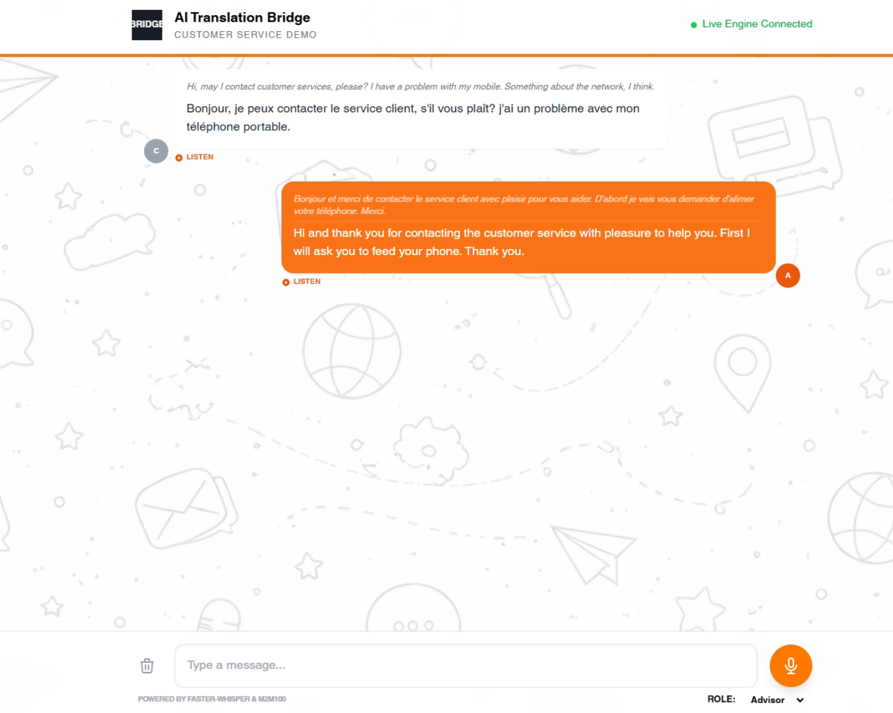

# Speech2Translate | AI Multilingual Showcase

### **What is this project?**
Speech2Translate is a high-performance translation bridge designed for real-time customer service environments. This repository serves as a **Technical Showcase** of a "Cascaded" AI pipeline, demonstrating that high-accuracy, private translation is achievable through localized models.

  

---

## Showcase Scope & Experience
This prototype demonstrates a modular, containerized microservices architecture capable of handling the core linguistic challenges of international customer support:

1.  **Acoustic Intelligence:** Leveraging **Faster-Whisper** to achieve near-human transcription accuracy even in low-bandwidth or noisy conditions.
2.  **Linguistic Fluidity:** Implementing **M2M100**, a "Many-to-Many" multilingual model that allows direct translation across 100+ languages without an English-pivot bias.
3.  **Voice-First UX:** A custom frontend utilizing the **Web MediaRecorder API** to capture, process, and display translations with sub-second backend response times.

---

## Project Architecture
The system is orchestrated via Docker to ensure environment parity between development and production.

### **File Structure Description**
* **`README.md`**
* **`.env`**
* **`docker-compose.yml`**
* **`/backend`**
    * `main.py`
    * `requirements.txt`
    * `Dockerfile`
* **`/frontend`**
    * `index.html`
    * `script.js`
    * `Dockerfile`
* **`/rsc`**
    * `screenshot.png`
    * `background.png`

---

## Getting Started
1.  **Environment Setup:** Ensure your `.env` is configured for your local hardware (CPU/GPU).
2.  **Deployment:** `docker-compose up --build`
3.  **Demonstration:** Access the local dashboard at `http://localhost/index.html`.

Customer : http://localhost/?role=customer
Advisor : http://localhost/?role=advisor